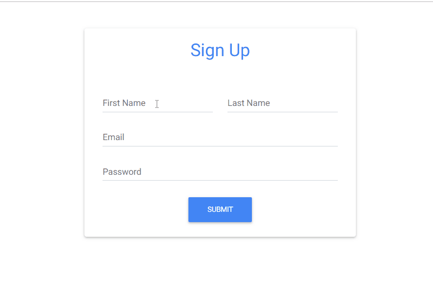

Material Design for Bootstrap

version: MDB Free 4.5.10

Documentation:
https://mdbootstrap.com/

Getting started:
https://mdbootstrap.com/getting-started/

Tutorials:
MDB-Bootstrap: https://mdbootstrap.com/bootstrap-tutorial/
MDB-Wordpress: https://mdbootstrap.com/wordpress-tutorial/

Templates:
https://mdbootstrap.com/templates/

License:
https://mdbootstrap.com/license/

Support:
https://mdbootstrap.com/forums/forum/support/

Contact:
office@mdbootstrap.com
## SignUp FORM

## Contact Form


# How to use MD Bootstrap
Copy paste this lines of code into your index.html to get started and download the css and js folder from this repository add them to your project thats all you need to import Material Bootstrap into your project.

```
<!DOCTYPE html>
<html lang="en">

<head>
    <meta charset="utf-8">
    <meta name="viewport" content="width=device-width, initial-scale=1, shrink-to-fit=no">
    <meta http-equiv="x-ua-compatible" content="ie=edge">
    <title>Material Design Bootstrap</title>
    <!-- Font Awesome -->
    <link rel="stylesheet" href="https://maxcdn.bootstrapcdn.com/font-awesome/4.7.0/css/font-awesome.min.css">
    <!-- Bootstrap core CSS -->
    <link href="css/bootstrap.min.css" rel="stylesheet">
    <!-- Material Design Bootstrap -->
    <link href="css/mdb.min.css" rel="stylesheet">
    <!-- Your custom styles (optional) -->
    <link href="css/style.css" rel="stylesheet">
  </head>

  <body>
      <!-- /Start your project here-->
      
      
      

    <!-- SCRIPTS -->
    <!-- JQuery -->
    <script type="text/javascript" src="js/jquery-3.3.1.min.js"></script>
    <!-- Bootstrap tooltips -->
    <script type="text/javascript" src="js/popper.min.js"></script>
    <!-- Bootstrap core JavaScript -->
    <script type="text/javascript" src="js/bootstrap.min.js"></script>
    <!-- MDB core JavaScript -->
    <script type="text/javascript" src="js/mdb.min.js"></script>
</body>

</html>
```
